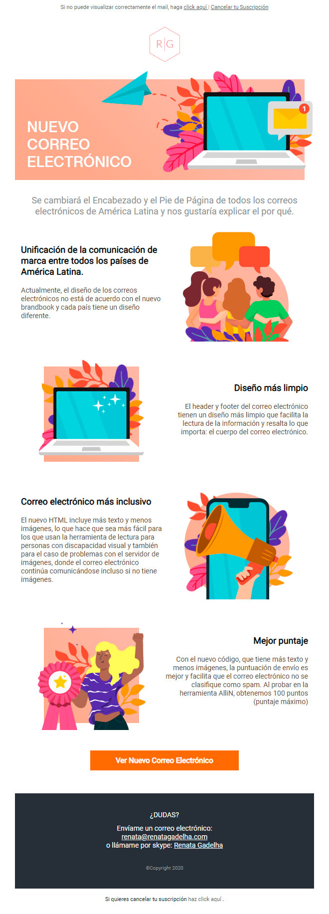

# Responsive E-mail

This is a responsive e-mail template.

## Setup

Clone the project. 
The main files is `responsive_01.html`.
The images and the fonts need to be hosted somewhere. :)
I tested this template using [AlliN sending tool](https://allin.com.br/) looking the final result in Outlook 2016, outlook.com and gmail.

## This project uses

- HTML (Table)
- CSS inline
- CSS Font face
- CCS Media screen
- Las imágenes originales utilizadas en este proyecto son de [Freepik](https://www.freepik.com/) 

## To do

- Review the spanish text.

