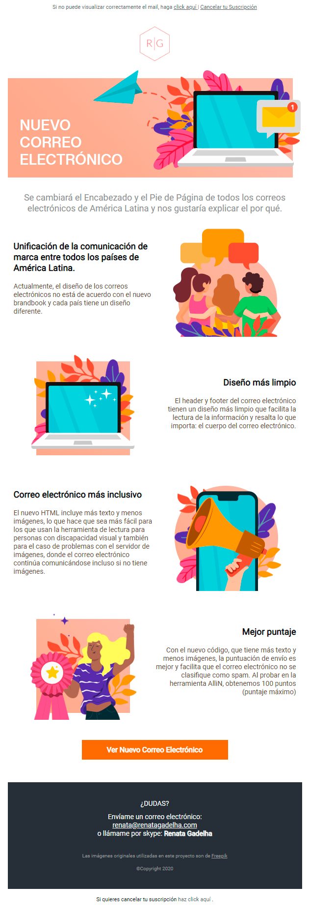

# Responsive E-mail

This is a responsive e-mail template.

## Setup

Clone the project. 
The main files is `responsive_01.html`.
The images and the fonts need to be hosted somewhere. :)
I tested this template using [AlliN sending tool](https://allin.com.br/) and looking the final result in Outlook 2016, outlook.com and gmail.

## This project uses

- HTML (Table)
- CSS inline +
- Font face
- Media screen

## To do

- Review the spanish text.

